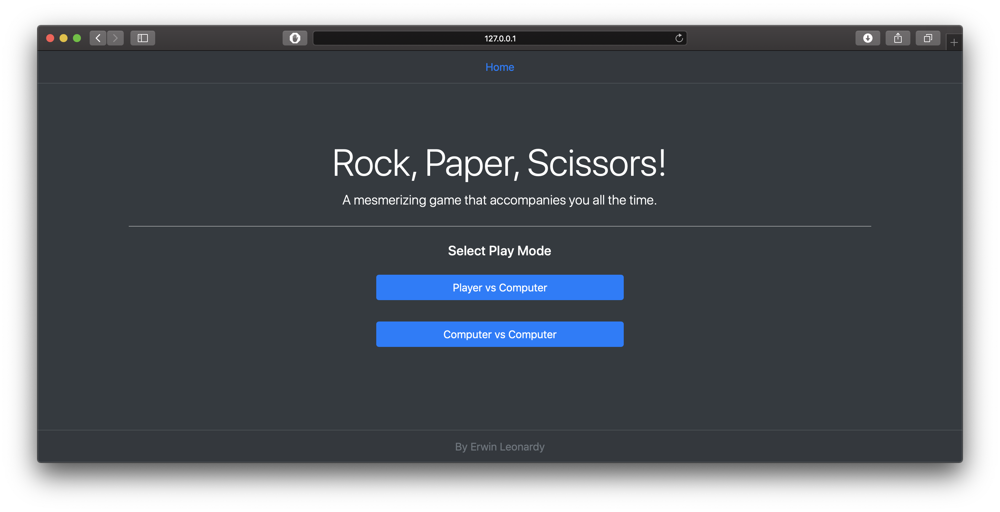

### Rock, Paper, Scissors Web Application Game
By Erwin Leonardy

***

This web application is built using **Flask**, which is a **Python** micro-framework.

##### System Design
An MVC (Model-View-Controller) architecture is chose to decouple the front-end, back-end and the database of the app. Hence, it will allow different developers to colloborate with each other without having to intefere with each other.

The factory model is chosen as the design pattern to promote the extensibility of the codes. Consequently, we only need to do a minute twist when we wish to add Lizard, Spock, or some other moves to the game. In fact, you only have to tweak the **model** class and **view** (add in the pictures) class to extend the application. 

With the factory model, we can refer to the object created with a common interface. Therefore, we can create objects without exposing the logic to the client.

##### Installation Guide
In order to play the game offline you would have to:
1. Install **Python 3.7** and above through the official website https://www.python.org/downloads/
2. You would have to install **pip** in order to download **Flask and Mock** (a testing tool library). You can download pip from this webiste https://pip.pypa.io/en/stable/installing/
3. Subsequently *cd* (change directory) to the main directory and locate the file called **requirements.txt**. Enter the following command to install Flask and Mock:
```
pip install -r requirements.txt
``` 
4. Now, we can start running our web application server through our command line and host the website locally. This can be achieved by typing the following command on the same directory:
```
FLASK_APP=main.py python -m flask run
```
5. Subsequently, your terminal will give you the IP Address (localhost) and the port number it used. For my case it is **http://127.0.0.1:5000/**
```
Running on http://127.0.0.1:5000/ (Press CTRL+C to quit)
```
6. Now, go to your favourite browser, preferabbly Chrome or Safari and enter the URL we obtained above.
7. Since the Bootstrap and jQuery were downloaded straight from the CDN. You would have to make sure that you have an internet connection. If the layout breaks (i.e doesn't look like the picture below), please check your connection.

8. Lastly, a testing script has been provided to test some of the possible scenarios. You can run it by going to http://127.0.0.1:5000/test, which executes the script **test.py** that is situated at *./src/controller/test.py*.